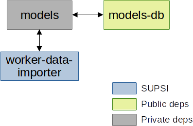

# [BF] Worker Data Importer

This repository describes how to use the Docker image for the *worker-data-importer* component, as part of the Cognitive Human Robot Interaction (C-HRI) scenario defined within the Better Factory project. The deployment is provided by means of Docker Compose, and the set of initialized components is depicted in the picture here below:



The blue-colored components represent the core components for which SUPSI provides and maintains a Docker image; the other components (grey- and green-colored) represent dependencies that are provided as Docker images by third parties.

> NOTE: In this deployment version, the only external dependencies that is available only in a private registry is *models*. The *models* image is provided and maintained by Holonix (HOL) within the Better Factory project.

### worker-data-importer
The *worker-data-importer* component downloads the worker responses collected with the "Consensus" questionnaire (GForm). Each response contains static data about the worker, which are pushed to the *models* component by means of its REST API. A cron job is exploited to download new responses.

### Dependencies

#### models
The *models* component exposes a REST API to access the data model shared among all the components involved in the C-HRI scenario. The API is used to update workers static data.

> NOTE: this image is available in a private Docker registry hosted at GitLab. Please ask HOLONIX to get access to this image.

#### models-db
The *models-db* component runs an official MySql docker image (v5.7).

## How to Use

### Requirements

All the components are provided as Dockerized applications, thus the following software is required:

- Docker
- Docker Compose

We tested our deployment on a machine running Ubuntu 21, with Docker v20.10.8, and Docker Compose v1.29.2.

### Install

Before running the containers, it is required to download the Docker images from their respective registries.
While some images are publicly available, some other require credentials to be downloaded from private registries.

> NOTE: Images provided by SUPSI can be download from the GitLab container registry, which supports the token-based authentication. Please send your request for a new token to the repository maintainers.

Once you are provided with a username and a token, you can issue the following command to login to the private GitLab Docker registry and download the images:

```shell
docker login registry.example.com -u <username> -p <token>
docker-compose pull
```

### Usage
The docker-compose file automatically runs all the components as Docker containers. Each container can be customized by editing its environment parameters. The current deployment already set the right values for all the parameters.
We suggest the user to only modify variables listed in the `.env` file, if needed.

| Parameter name             | Parameter value | Default |
| -------------------------- | --------------- | ------  |
| BF_USER | A username shared by all the components | **bfuser** |
| BF_PASSWORD | A password shared by all the components | **bfpwd123** |
| MODELS_MYSQL_DATABASE | Name of the database to store the shared model | **models**|
| MODELS_MYSQL_ROOT_PASSWORD | Password for the root user in MySQL | **root** |
| CREDENTIALS | A JSON file containing the Google Service account credentials to access the GForm responses. | **/app/service_account.json** |
| SPREADSHEET | The name of the Google Spreadsheet containing the GForm responses. | **[BF] Worker Profiling (Risposte)** |
| FIELDS_MAP | A JSON file providing the mapping between the GForm questions and the ConsensusWorker parameters | **/app/fields_map.json** |

> NOTE: To download responses from the Google Spreadsheet, a JSON file containing the user credentials is needed. The file will be provided upon request.

Run the **up** command to start all the containers:

```bash
docker-compose up -d
```

## Maintainers

- Vincenzo Cutrona - vincenzo.cutrona@supsi.ch
- Giuseppe Landolfi - giuseppe.landolfi@supsi.ch
